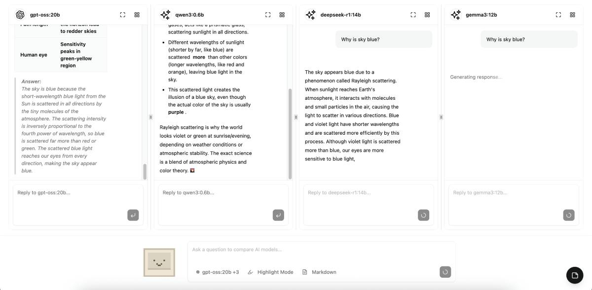

# multi-writer

> Chat with multiple LLM with [LiteLLM](https://www.litellm.ai/), ask one prompt, and compare & highlight responses in parallel



**Architecture**
- `frontend/`: Vue 3 + Vite UI.
- `backend/`: LiteLLM config and env for the AI API proxy.
- `docker-compose.yml`: runs the LiteLLM backend and the frontend dev server.

**Quick Start (Docker)**
1. Ensure you have Docker installed.
2. Ensure models(online or local) in [`backend/litellm_config.yaml`](https://docs.litellm.ai/docs/proxy/configs) are available.
3. Create `backend/.env` and add any provider keys you want to use.
4. Create `frontend/.env` if you want to override defaults:
   - `VITE_LITELLM_API_URL` (default: `http://localhost:4000/v1`)
   - `VITE_LITELLM_API_KEY` (default: `sk-1234`)
5. Start the stack:

```bash
docker compose up --build
```

**Local Development (without Docker)**
1. Run LiteLLM in one terminal, pointing it at `backend/litellm_config.yaml`.
2. In another terminal:

```bash
cd frontend
pnpm install
pnpm dev
```
